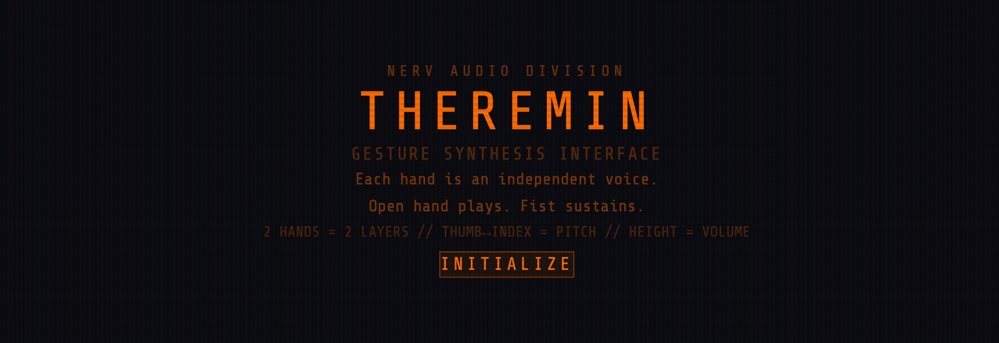
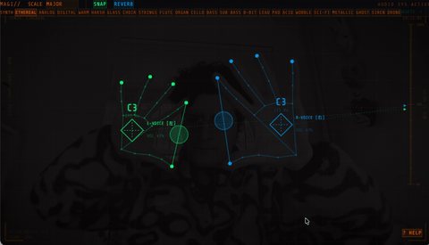

<h1 align="center">Neo Theremin</h1>
<p align="center">A browser-based gesture synthesis instrument.<br>
Use your webcam to track hand movements and control sound in real time.</p>
<p align="center"><a href="https://neo-theremin.vercel.app"><strong>Try it live →</strong></a></p>

---





## How It Works

Each hand is an independent voice. Move your hands in front of the camera to play.

### Controls

| Input | Effect |
|-------|--------|
| **Thumb-Index distance** | Pitch (close = high, spread = low) |
| **Hand height** | Volume (high = loud, low = quiet) |
| **Open hand** | Play |
| **Horns (index + pinky up)** | Sustain (holds volume, pitch still changes) |
| **Fist** | Mute |
| **Point (index only)** | Vibrato |
| **Peace (index + middle)** | Filter sweep |
| **Open mouth** | Siren effect |

### Features

- **Two independent voices** — each hand plays its own synth voice
- **21 synth packs** — from Ethereal and Strings to Acid and Sci-Fi
- **5 musical scales** — Major, Minor, Pentatonic, Blues, Chromatic
- **Snap mode** — quantizes notes to the selected scale
- **Reverb toggle** — adds convolution reverb
- **Mouth detection** — triggers a rising siren tone
- **EVA/NERV-inspired HUD** — scanlines, crosshairs, gesture labels, pitch/volume indicators
- **Help modal** — in-app gesture reference

## Tech Stack

- **React** + **Vite**
- **Tailwind CSS v4**
- **MediaPipe Tasks Vision** — HandLandmarker (2 hands, 21 landmarks each) + FaceLandmarker (mouth detection)
- **Web Audio API** — dual oscillators per voice, biquad filters, convolver reverb, wave shaper

## Getting Started

```bash
npm install --legacy-peer-deps
npm run dev
```

Requires a webcam and a modern browser (Chrome/Edge recommended for best MediaPipe GPU performance).

## Project Structure

```
src/
  App.jsx                    # Main app, camera setup, audio loop
  index.css                  # CRT effects, scanlines, vignette
  hooks/
    useHandTracking.js       # MediaPipe hand + face detection
    useTheremin.js           # Web Audio synth engine, 21 packs
  components/
    HandCanvas.jsx           # Canvas overlay with EVA-style HUD
    Controls.jsx             # Synth pack selector, scale, toggles
    HelpModal.jsx            # Gesture reference modal
    Onboarding.jsx           # Start screen + loading
```

## Deployment

Deployed on Vercel at [neo-theremin.vercel.app](https://neo-theremin.vercel.app).

```bash
vercel --prod
```

## Feedback

Found a bug or have a feature idea? [Open an issue](https://github.com/madebysan/neo-theremin/issues).

## License

[MIT](LICENSE)

---

Made by [santiagoalonso.com](https://santiagoalonso.com)
