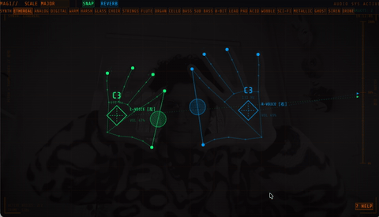

<h1>Neo Theremin</h1>

<p>Play a browser-based synthesizer with your hands.<br>
Your webcam tracks each hand and turns movement into sound.</p>

<p>
  
  
  
  
</p>

<p><a href="https://neo-theremin.vercel.app">Try it live</a></p>



## How it works

Each hand controls an independent synth voice. Move in front of the camera to play, change pitch and volume, switch scales, or add effects. Neo Theremin includes 21 synth packs, five musical scales, note snapping, reverb, and an in-app gesture guide.

| Input | Effect |
|-------|--------|
| **Thumb-Index distance** | Pitch (close = high, spread = low) |
| **Hand height** | Volume (high = loud, low = quiet) |
| **Open hand** | Play |
| **Horns (index + pinky up)** | Sustain (holds volume, pitch still changes) |
| **Fist** | Mute |
| **Point (index only)** | Vibrato |
| **Peace (index + middle)** | Filter sweep |
| **Open mouth** | Siren effect |

The on-screen HUD shows tracked hands, gesture labels, pitch, and volume. Opening your mouth triggers a rising siren tone.

## Tech stack

- **React** + **Vite**
- **Tailwind CSS v4**
- **MediaPipe Tasks Vision:** HandLandmarker for two hands and FaceLandmarker for mouth detection
- **Web Audio API:** dual oscillators, filters, convolution reverb, and wave shaping

## Run locally

```bash
npm install --legacy-peer-deps
npm run dev
```

Requires a webcam and a modern browser. Chrome or Edge currently gives MediaPipe the most reliable GPU path.

## Feedback

Found a bug or have a feature idea? [Open an issue](https://github.com/madebysan/neo-theremin/issues).

## License

[MIT](LICENSE)

Made by [santiagoalonso.com](https://santiagoalonso.com)
